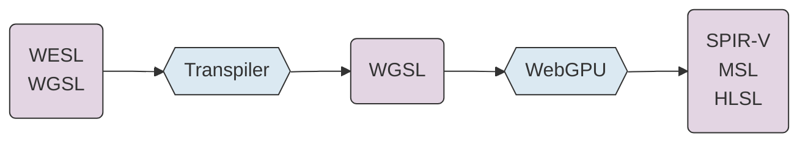
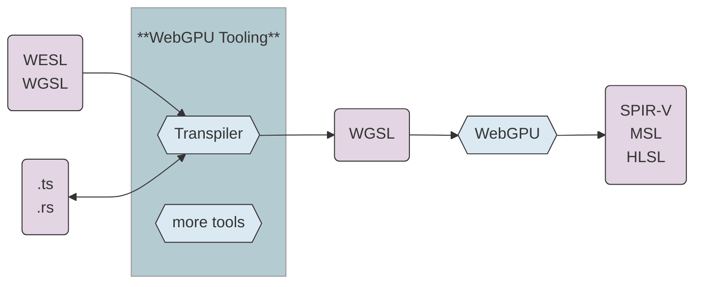
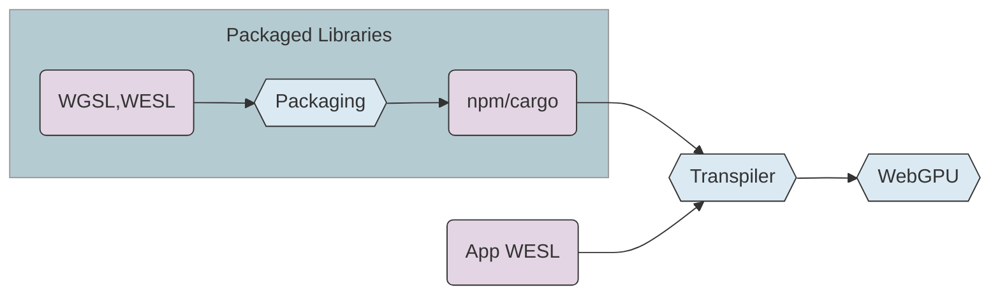
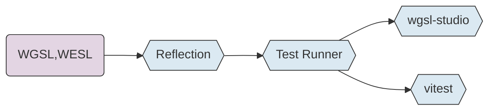

<!--
TODO:
- add urls for wgsl-test, wgsl-studio, wgsl-analyzer, 
- add url to presentation

- runnable example for mandelbrot
- IDE demo
- wgsl-play demo
- wgsl-studio demo

- jannik's doc generator. 
- static screen shots as demo placeholders

- extra slides for upcoming wgsl features 
  - [might be nice to get feedback on these outside/after the talk]
  - param const
  - wildcard imports
  - @publish
  - more?
-->

# WESL

A Pioneer Language for WebGPU


<div class="mt-12">

Lee Mighdoll

Stefan Brandmair

Mathis Brossier (in spirit)

</div>

<div class="absolute bottom-2 right-4 text-sm             
text-gray-400">                                           
Shader Languages Symposium<br>
February 2026
</div>

<!--
We're going to talk about our extensions to WebGPU's WGSL

and the user tooling needs that drive those extensions.
-->

---

# Vision

<div class="mt-6 space-y-6">

### Empower a new generation of shader developers

### Integrate GPU programming into modern development

### Flourishing of GPU apps, big and small
</div>


<!--
A vision for WebGPU, we think WESL can help.
-->
---

# Why Extend WGSL/WebGPU?


### Pioneer new features with low risk

<div class="mt-2 ml-4">
Explore first 
</div>

<div class="mt-2 ml-4">
Browser changes are forever
</div>

<br/>

### Some features might not belong in browsers

<div class="mt-2 ml-4">
Load shader modules incrementally from external sources
</div>

<div class="mt-2 ml-4">
Hooks for test frameworks
</div>

<div class="mt-2 ml-4">
Shader library packaging formats
</div>

<!--
We actually started down this because we were trying to fill some community needs for WebGPU tooling.

We discovered that we really wanted some language extension features to support tooling.

That's where we started. Basically trying to write #include but better.

As we got going, we realized that:

Extending the language outside the browser core makes sense for two reasons:
- it's easier to iterate: open source tools vs. multiple browsers.
- some features may never need to go into the browser core.
-->

---

# Support for WGSL/WebGPU

<div class="mt-8 space-y-6">

### WESL language features designed as potential WGSL features

### Collaborate on language experiments

### Support core WGSL/WebGPU development

</div>

<!--
We try to work closely with the WebGPU committee. 

WESL extensions are designed to be possible future browser implementation.

Our work is a support, not a substitute for WebGPU/WGSL.
-->

---

# WESL Language Aims


### Practical

Always driven by community needs

### Strict Superset of WGSL

<div class="ml-6 mt-4">
WGSL is WESL

WebGPU Conformance Test Suite (CTS)

</div>

### Support WebGPU Ecosystem

<!--
We drive language design from use cases from community shaders 
- and of course from tool development.

We want to help grow the ecosystem, not create a splinter language.

We maintain and test for strict upward compatibility with WGSL. Our tools run the same compatibility test suite as the browsers.

WGSL is WESL. 

All our tools support vanilla WGSL plus a sprinkling of extra features.
-->

---

# Power Features and Simple Users

<div>


</div>

<!--
A thought on how we think about the **design center** for WebGPU/WGSL/WESL.

We expect that as WebGPU proliferates, there'll be a lot of small projects.
Lots of part time shader programmers. 
So there's a premium on **simplicity**.

Meanwhile we want to support useful libraries, and larger game engines,
like Bevy.  So we judiciously add power to the language.

Also, we're "blessed" with supporting multiple host languages. 

We try to chart a neutral path and not to match Rust or TypeScript or C++ 

or any other of our favorite languages like ocaml or scala or LEAN.
-->

---

# WESL Syntax

````md magic-move
```wgsl

alias Complex = vec2f;

fn mandelbrot(position: Complex) -> f32 { 
  .
  .
}

@fragment
fn main(@location(0) uv: vec2f) -> @location(0) vec4f {
  let escaped = mandelbrot(uv * 3.0 - vec2f(2.0, 1.5));    
  let color = vec3f(escaped);
 
  return vec4(color, 1.0);
}
```
```wgsl
import super::graphics::mandelbrot;

@fragment
fn main(@location(0) uv: vec2f) -> @location(0) vec4f {
  let escaped = mandelbrot(uv * 3.0 - vec2f(2.0, 1.5));    
  let color = vec3f(escaped);
 
  return vec4(color, 1.0);
}
```
```wgsl
import super::graphics::mandelbrot;
import lygia::color::palette::spectral::zucconi::zucconi6;

@fragment
fn main(@location(0) uv: vec2f) -> @location(0) vec4f {
  let escaped = mandelbrot(uv * 3.0 - vec2f(2.0, 1.5));    
  let color = zucconi6(escaped);

  return vec4(color, 1.0);
}
```

```wgsl
import super::graphics::mandelbrot;
import lygia::color::palette::spectral::zucconi::zucconi6;

@fragment
fn main(@location(0) uv: vec2f) -> @location(0) vec4f {
  let escaped = mandelbrot(uv * 3.0 - vec2f(2.0, 1.5));    

  @if(debug)
  let color = escaped;
  @else
  let color = zucconi6(escaped);

  return vec4(color, 1.0);
}
```

````

<!--
A peek at some of the extensions in WESL:

starts with WGSL

adds modules so people can split their shaders into separate files

adds packaged library support so people share the modules across organizations

adds conditionals so people can customize shaders at build or runtime
-->

---

# WESL Today

### Language Features
Import, conditional compilation

### Shader libraries for npm (JavaScript) and cargo (Rust)
Libraries of shader functions

<!--
Core feature set in our first release last year:

robust module system

conditional compilation

npm/cargo library support
-->

---

# WESL Tomorrow

### Module System Enhancements
<div class="mt-4 ml-6">
Wildcards

Visibility control
</div>

### Host / Shader Interface
<div class="mt-4 ml-6">
Parameterized modules 

Reflection

</div>

### Generics / Typeclasses
<br/>

<!--
There are a number of language features under way. Wildcards, visibility.

More attention on the shader/host interface in general.

Parameterized modules -> injected constants as conditions

Medium term, Reflection and Generics should enable a richer class of apps and libraries
-->

---

# WESL - a Shader Front End


<div class="mt-2 space-y-6">

### language ergonomics (modules, generics)

### shader/host code integration (reflection, injection)

</div>

<!--
Of course, there are limits to what we can do with WESL.

We a shader front end.

We can rewrite shader source code,

but the underlying vulkan/metal/D3D12 APIs are inaccessible to us. 

So we can try generics in WESL, but not bindless.
-->

---
layout: center
---

# Tools

---

# WESL Enables WebGPU Tooling


<div class="mt-2 space-y-6">

### 2025 - Linking and Packaging Tools
### 2026 - Testing, Documentation, IDE tools

</div>

<!--
As mentioned, our goal has always been to enable WebGPU tools, 
not just language enhancements.

We started with linking and packaging tools.

A lot more is coming on the tools front. 

We'll show snapshots of those tools next.
-->

---

# WebGPU Tooling
For WESL and WGSL

<div class="grid grid-cols-2 gap-4 mt-4">

<div class="border rounded-lg p-4 bg-gray-50">

### Linking / Packaging
<div class="ml-4 mt-2">

wesl-plugin - vite/rollup/webpack 

build.rs - rust integration

wesl-cli - link or package from cli
</div>
</div>

<div class="border rounded-lg p-4 bg-green-50">

### Editor Support
<div class="ml-4 mt-2">

wgsl-analyzer - IDE Language Server

wgsl-edit - web editor

</div>

</div>

<div class="border rounded-lg p-4 bg-green-50">

### Documentation Tools 
<div class="ml-4 leading-8 mt-2">

wesl-doc - HTML documentation generator

wgsl-play - web samples

</div>
</div>


<div class="border rounded-lg p-4 bg-green-50">

### Test Tools
<div class="leading-8">

wgsl-test - native and vite/jest tests

wgsl-studio - IDE test runner

</div>

</div>

</div>

<!--
These are some of the needs we hear about from the community. 

Editor support

Online documentation

Testing support
-->

---
layout: center
---

# Linking and Packaging

---

# Linking Shader Modules

<div class="grid grid-cols-2 gap-4 mt-8">

<div>


### TypeScript
```ts
import { link } from "wesl";
import appWesl from "./shaders/app.wesl?link";

const linked = await link(appWesl);

linked.createShaderModule(device);

```

**vite** / **webpack** / **rollup** plugins


</div>

<div>


### Rust
```rs
use wesl::Wesl;

let wgsl_str = Wesl::new("shaders")
    .compile("app.wesl")
    .unwrap()
    .to_string();
```

**build.rs** integration

</div>

</div>

<div class="space-y-6 mt-12">

### Transpile & link at build or runtime

### CLI linkers also available

</div>

<!--
A peek at what linking looks like for an app.

Our goal:

very few lines of code to add WESL to a WebGPU project

Meet developers where they are.
Plugin the tools/workflow they already use.

So significant effort towards making e.g. JavaScript/TypeScript bundler plugins.

If you're a typescript developer using a bundler the left side should look vaguely familiar 

If you're a rust developer, plugging into build.rs should be familiar.

cli tools are also available for linking too, for users with more custom build setups

And a playground for people who want to view the WESL to WGSL transpilation.

.. Not just app shaders
-->

---

# npm and cargo Libraries

<div class="mt-8">


</div>

<div class="space-y-4">

### Creating a Library is Easy
<div class="ml-8">

`wgsl-packager` command for npm

`wesl_pkg` macro for crates

</div>

### 

### Tools are Library Aware
</div>

<!--
Our goal is to make it easy to create shader libraries.

The WebGPU community right now is full of copy-pasta

Packaging a shader or a collection of shaders is 
- one cli command for npm
- one line of code for rust
-->

---


<!--
Shader libraries as npm packages
-->

<div class="mt-4 space-y-2">

#### Usage

`npm add lygia`

</div>

<!--
use for example Lygia a large collection of shader functions from the Book of Shaders

just:  npm add lygia

just like you would any other package
-->

---


<!--
shader libraries as Rust crates

same sources, published two ways.
-->

<div class="mt-4 space-y-2">

#### Usage

`cargo add lygia`
</div>

<!--
and cargo will just about the same way

in a few days :-)
-->

---

# Designing a Library Format for WebGPU

<div class="mt-8 space-y-6">

### Text format for stability
<div class="ml-8">
Human-readable, diffable, versionable

Optimize size/speed when the library is used
</div>

### npm/cargo mappings
Don't reinvent package management

### Simple encoding = stable encoding
Minimize complexity for long-term compatibility

</div>

<!--
Zoom in on one issue that's been an ongoing interest for us: 

Enabling Libraries for WebGPU

The tools and extensions we've built are now enough to start a library ecosystem for WebGPU.

Considered some compressed formats, but prefer text for stability.

Prefer to apply those optimizations in apps. 
- Envision applying minification, or AST precompilation, per app, not baking into the library format.

Chose to embed within existing packaging systems, not build a WebGPU specific one.

-->

---

# JS Library Embedding

```ts
/// dist/weslBundle.js
export const weslBundle = {
  name: "lygia",          // basic metadata
  edition: "2026_pre",
  modules: {
    "math/permute.wesl":  // relative paths to support shader linking

        // shader source text
    ` import lygia::math::mod289; 
      fn permute(x: f32) -> f32 { 
        return mod289(((x * 34.0) + 1.0) * x); 
      }`
  },
  dependencies: [],       // js handles dependencies & versions
};
```

Shaders are packaged as JavaScript strings.

The library publisher builds the bundle.

Tools read packages automatically (vite, webpack, cli, test).

<!--
The npm library bundle format is automatically generated.

It looks like roughly like this on the inside:

mostly, just the shader text:

plus a minimal set of metadata

like the relative path, for module linking

and dependencies to other bundles for inter-library references
-->

---

# Rust Library Embedding

<div class="grid grid-cols-2 gap-4 mt-4">
<div>

#### Publisher 

```rs
/// lib.rs
use wesl::wesl_pkg;

wesl_pkg!(random);
```
</div>

<div>

#### Library Consumer

```rs
/// build.rs
fn main() {
  wesl::PkgBuilder::new("random")
    .scan_root("src/shaders").unwrap()
    .build_artifact().unwrap();
}
```

</div>
</div>

Rust shader libraries are packaged as shader source files plus a macro call.

The `wesl_pkg` macro loads the sources into Rust strings. 

The library user builds the bundle.

<!--
The rust format is similar internally to the npm one,
shaders are packaged as rust strings.

Rust conventions let us construct the embedding as the developer *uses* the library.
-->

---
layout: center
---

# Testing

---

# wgsl-test / wgsl-studio



<div class="space-y-4">

### Unit Testing
Test shader functions with assertions in WGSL or TypeScript

### Image Snapshot Testing
Visual regression testing with diff reports

### wgsl-studio
VS Code extension for running tests, previewing images

</div>

<!--
Goal: integrate with existing test frameworks and VSCode

Unit testing (something increasingly important in the AI era)

image snapshot testing
-->

---

# `wgsl-test`: Unit Tests

```wgsl
/// interp_test.wesl
import package::interp::smootherstep; // source fn to test
import wgsl_test::expectNear;         // expectations 

@test  // tag each test fn
fn smootherstepQuarter() {
  const result = smootherstep(0.0, 1.0, 0.25);
  expectNear(result, 0.103516);
}
```

Test shader functions with shader functions

Validate with shader functions

Run tests with wgsl-test cli runner

Tests run in Node (Dawn) or Deno (wgpu)


<div class="absolute bottom-0">

[wgsl-test](https://github.com/wgsl-tooling-wg/wesl-js/tree/main/tools/packages/wgsl-test)
</div>

<!--
We want to write tests in shader code

that's how shader functions are meant to be called

Validate (expect functions) in shader code where that's easy.
Add more shader validators over time
enables more tests to be described fully in shader code.

The tests can run using Google's Dawn or Mozilla's implementation of WebGPU
-->

---

# `wgsl-test`: Vitest Integration Available
or jest or mocha

```ts
import { testCompute } from "wgsl-test";

const src = `
  import package::hash::lowbias32;

  @compute @workgroup_size(1)
  fn main() {
    test::results[0] = lowbias32(0u);
    test::results[1] = lowbias32(42u);
  }
`;

const result = await testCompute({ device, src });
```

Return a result and validate in any test library

Handy for complicated validation / setup

<!--
here's a simple example of running the same kind of test and returning the result back to
to run validation in TypeScript.

In this simple example there's no need,
but you can imagine for complicated statistical tests or something, you might prefer to write the validation in host code.
-->

---

# `wgsl-test`: Image Snapshot Tests


<!--
you can also do image snapshot testing.

It produces a nice little html report on failures.

This is a test from Lygia, looking at a few of the signed distance functions.
-->

---

# wgsl-studio: VSCode Tests


<!--
We've a new vscode extension available called wgsl-studio.

It uses the wgsl-test core (and the Dawn webgpu engine) to support a test runner in the browser.

On the left you can see that the 'test explorer' shows both vitest tests and native tests.

On the right you can see errors reported along with the failing function.

As an aside on design here..
The astute observer might notice that the error is reported at the function, not the 'expect' call that's failing.

This is an example of how tool needs can drive the design for language extensions. 
- users want a tool to run tests in their dev environment
- to build a better tool, we need some language affordance to report the current source line.

We're setup to do that now, it's a good place to be.
-->

---

# wgsl-studio: VSCode Shader Previews


<!--
Image Snapshot tests are visible in wgsl-studio. 

here the user has right clicked 'show preview'

These are rendered live with the gpu.

We're aiming for a convergence between the test api and preview api.

Remember the test case from a few slides ago.
This literally the same code.

Direction / observation
Adding annotations to shaders for image tests is pretty similar to adding annotations for shader previews.

that'll be future work..

your thoughts welcome on test and shadertoy style interfaces!
-->

---
layout: center
---

# Web Site Tools

<!--
next set of tools

adding WebGPU to web sites.
-->

---

# wgsl-play / wgsl-edit

<div class="mt-8 space-y-6">

### Interactive Code Samples
Editable shader examples embedded in documentation

### Live Preview
See shader output in real-time as you edit

</div>

<!--
Some web components for use on web pages

Editable sample code with live error checking.

Web developers can embed a player.
-->

---

# `<wgsl-play>`: Web Viewer 

<div class="grid grid-cols-2 gap-4 mt-4">

<div class="space-y-4">

```html
/// index.html
<wgsl-play id="player"></wgsl-play>
```

<div class="mt-4">

### Shader inline in HTML

</div>

<v-click>

<div style="margin-top: 2rem;">

```ts
/// app.ts
import shader from "./draw_shapes.wesl?link"

document.querySelector("#player").project = shader
```

</div>

<div>

```rs
/// draw_shapes.wesl
import lygia::space::rotate;
import lygia::sdf::gearSDF;
...
```

</div>

<div class="mt-4 space-y-2">

### Shaders in separate files

</div>

</v-click>

</div>

<div>

<wgsl-play id="demo-player" style="width: 400px; height: 400px; display: block;"></wgsl-play>

</div>

</div>

<script setup>
import { onMounted } from "vue"
import { initPlayer, drawShapesProject } from "./wgsl-demos"
onMounted(() => initPlayer("demo-player", drawShapesProject))
</script>

<!--
first,

wgsl-play is a convenient way to put simple shaders on a web page

note that this is the same code as the image snapshot tests,
so regression tests can do double duty as demos.

and it's also used inside the vscode extension.

you can put the shader code inline in the html

or keep it in a separate file.

in this example we're using the wesl-plugin's ?link

That automatically loads all the dependencies from draw-shapes.wesl

It's handy to have language extension for shader module composition that's aware of libraries
-->

---

# `<wgsl-edit>`: Web Editor

<div style="display: flex; gap: 1rem; margin-top: 1rem;">
  <wgsl-edit id="demo-editor" style="flex: 1; min-width: 0; overflow: hidden; height: 400px; display: block;" theme="light"></wgsl-edit>

<div style="width: 400px; flex-shrink: 0;">

```html
/// index.html
<wgsl-edit id="edit"></wgsl-edit>
```

<v-click>

<div style="margin-top: 2rem;">

### Combine with wgsl-play
</div>

<div style="margin-top: .5rem;">

```html
<wgsl-play id="play" source="edit"></wgsl-play>

<wgsl-edit id="edit" lint-from="play"></wgsl-edit>
```
</div>

</v-click>

</div>
</div>

<script setup>
import { onMounted } from "vue"
import { initEditor, mandelbrotProject } from "./wgsl-demos"
onMounted(() => initEditor("demo-editor", mandelbrotProject))
</script>

<!--
another web component called wgsl-edit
for people who want to put a WebGPU shader editor on their sites

uses codemirror under the hood, easy to embed even on mobile

tabbed interface

inline errors

again just a couple of lines to drop onto your web page and you can have a wgsl editor.

and it interoperates with wgsl-play
-->

---

# wgsl-edit + wgsl-play

<div style="display: flex; gap: 1rem; height: 420px; margin-top: 1rem;">
  <wgsl-edit id="combo-editor" style="flex: 1; min-width: 0; overflow: hidden; display: block;" theme="light"></wgsl-edit>
  <wgsl-play id="combo-player" style="width: 400px; aspect-ratio: 1; flex-shrink: 0; align-self: start; display: block;"></wgsl-play>
</div>

<script setup>
import { onMounted } from "vue"
import { initEditor, mandelbrotProject, connectPlayerToEditor } from "./wgsl-demos"
onMounted(() => {
  initEditor("combo-editor", mandelbrotProject);
  connectPlayerToEditor("combo-player", "combo-editor");
});
</script>

<!--
editor and player linked: edit code, see live output

[edit vec4f to vec3f]
see errors from Dawn

[rm comma after purple]
see errors from the WESL transpiler

It's all web based.. so we can do things like
load new packages straight from npm on demand.

I'm going add a little noise to the image from another npm library

 + .5 * random_wgsl::pcg_2u_3f(vec2u(pos.xy))

watch the lower left

[add semicolon]

That's the notification as the web page loads from npm.
-->

---


# wgsl-analyzer

<div class="mt-8 space-y-6">

### Language Server for WGSL/WESL

- Syntax highlighting
- Error diagnostics
- Go to definition
- Autocomplete
- Hover information
- Formatter

</div>

<!--
TBD
-->

---
layout: center
---

# Closing Thoughts

---

# WESL for other Shader Languages?

<div>

### Lowest common denominator for WebGPU reuse:
<div class="mt-4 ml-6">
WGSL + modules

basic conditional compilation
</div>

### Define stable subset of WESL as target format?
<div class="mt-4 ml-6">
npm/cargo packaging for libraries

reuse the tool ecosystem 
</div>

</div>

<!--
As WebGPU grows in popularity, and 
especially if our tooling proves useful...

It might be helpful to define a stable subset of WESL for other languages to target. Arguably what you want is wgsl+modules and conditions.

After all, if you want to target WebGPU, you'll likely face the same ecosystem tooling integration issues that led us down this path.
-->

---

# Extension Language Roles

<div class="mt-8 space-y-6">

### Elm
A respected niche language in a divergent direction

### TypeScript
Transpiling becomes a permanent part of the ecosystem

### Scala
Pioneer features that often migrate to the base language

<v-click>

### WESL
We'll see!

</v-click>

</div>

<!--
We think WESL and its tooling can be an ongoing help for the WebGPU community. 

What role WESL will play is uncertain..
-->

---

# Advice Welcome
WESL has a lot to learn

We'd love to hear experiences from other shader communities.

### Current Discussions

- wildcard imports
- parameterized modules
- visibility: modules, libraries, and shader-to-host
- generics / typeclasses / context classes
- reflection

<!-- 
We'd love your advice on shader languages.

Really on any topic, but I've listed a few that we're currently talking about.
-->

---
layout: center
---

# Thank You

<div class="mt-12">

[wesl-lang.dev](https://wesl-lang.dev) 

[WESL discord](http://discord.gg/Ty7MjWVfvh)

</div>

---
layout: center
---

# Extras

---

# Extensions Enable Tools

<div class="mt-4">

<p><em>+ imports + std config</em> <v-click><span>→ cli link, vite plugins, language server</span></v-click></p>
<v-click><p><em>+ packaging format</em> <v-click><span>→ npm/cargo libraries </span></v-click></p></v-click>
<v-click><p><em>+ annotations + reflection</em> <v-click><span>→ wgsl-test</span></v-click></p></v-click>
<v-click><p><em>+ libraries</em> <v-click><span>→ wgsl-play, wgsl-edit</span></v-click></p></v-click>
<v-click><p><em>+ conditions + visibility + generics</em> <v-click><span>→ richer libraries</span></v-click></p></v-click>

</div>

<!--
Pooling user requested extensions lets us make *shared tooling* to benefit many projects.

And tools themselves create new needs from the shader language. 

A virtuous cycle.
-->
