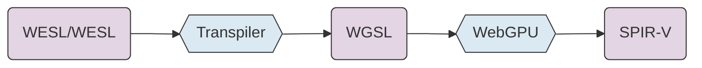
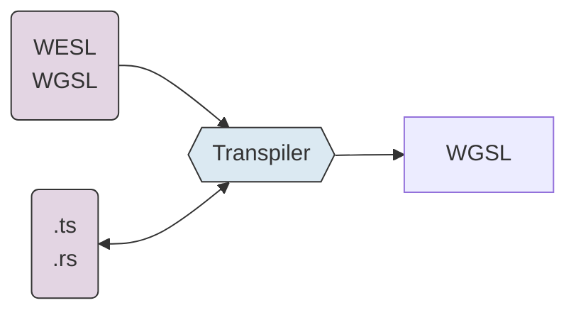
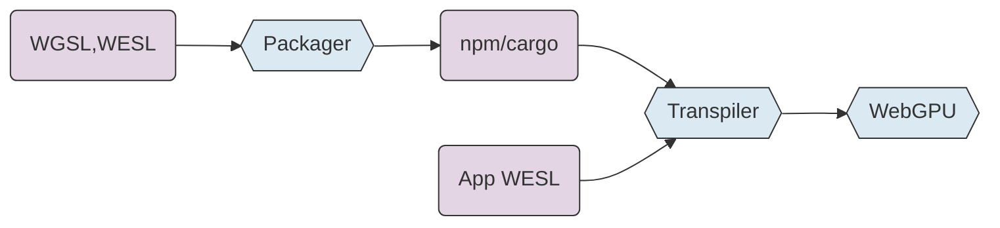
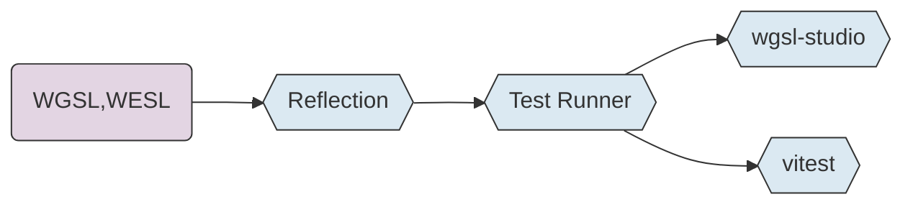

<!--
TODO:
- add urls for wgsl-test, wgsl-studio, wgsl-analyzer, 
- add url to presentation
- much review/revise
- add speaker notes
- trim for time?

- runnable example for mandlebrot
- IDE demo
- wgsl-play demo
- wgsl-studio demo
- library demo with js and rust
- try jannik's doc generator. 
- static screen shots as demo placeholders

- extra slides for upcoming wgsl features 
  - [might be nice to get feedback on these outside/after the talk]
  - param const
  - wildcard imports
  - @publish
  - more?

-->

# WESL

A Pioneer Language for WebGPU


<div class="mt-12">

Lee Mighdoll

Stefan Brandmair

Mathis Brossier (in spirit)

</div>

<div class="absolute bottom-2 right-4 text-sm             
text-gray-400">                                           
Shader Languages Symposium<br>
February 2026
</div>                                                    
---

# Vision

<div class="mt-6">
Empower a new generation of shader developers

GPU programming integrated into modern development

Flourishing of GPU apps, big and small
</div>


<!--
A vision for WebGPU, we think WESL can help.
-->
---

# Why Extend WGSL/WebGPU?


### Pioneer new features cheaply

<div class="mt-2 ml-4">
Explore first 
</div>

<div class="mt-2 ml-4">
Browser changes are forever
</div>

<br/>

### Some features might not belong in browsers

<div class="mt-2 ml-4">
Load shader modules incrementally from external sources
</div>

<div class="mt-2 ml-4">
Hooks for test frameworks
</div>

<div class="mt-2 ml-4">
Shader library packaging formats
</div>

<!--
Support community needs for tooling, and language features to support tooling
-->

---

# WESL Language Aims


### Practical

Always driven by community needs

### Strict Superset of WGSL

<div class="ml-6 mt-4">
WGSL is WESL

WebGPU Conformance Test Suite (CTS)

</div>

### Support WebGPU Ecosystem

<!--
We want to help grow the ecosystem, not create a splinter language.
-->

---

# Support for WGSL/WebGPU

<div class="mt-8 space-y-6">

### WESL language features designed as potential WGSL features

### Stay in sync on ideas

### Support core WGSL/WebGPU development

</div>
---

# Power Features and Simple Users

<div>


</div>

<!--
Expect that as WebGPU proliferates, there'll be a lot of small projects.
Lots of part time shader programmers. 
So there's a premium on simplicity.

Meanwhile we want to support useful libraries, and larger game engines,
like Bevy.  So we have judiciously add power to the language.

Also, we're "blessed" with supporting multiple host languages. 
We try to chart a neutral path and not match Rust or TypeScript
or any other of our favorite languages.
-->

---
# TBD
WebGPU community shader tools and extensions 

### WESL Language Extensions
- Modules
- Conditions
- Libraries
- ...

### Tool Support

- WESL Transpiler, js bundler integration 
- WGSL/WESL Language Server
- WGSL/WESL Test Runner
- doc tools
- web components
- ...
---

# WESL Syntax

````md magic-move
```wgsl

alias Complex = vec2f;

fn mandelbrot(position: Complex) -> f32 { 
  .
  .
}

@fragment
fn main(@location(0) uv: vec2f) -> @location(0) vec4f {
  let escaped = mandelbrot(uv * 3.0 - vec2f(2.0, 1.5));    
  let color = vec3f(escaped);
 
  return vec4(color, 1.0);
}
```
```wgsl
import super::graphics::mandlebrot;

@fragment
fn main(@location(0) uv: vec2f) -> @location(0) vec4f {
  let escaped = mandelbrot(uv * 3.0 - vec2f(2.0, 1.5));    
  let color = vec3f(escaped);
 
  return vec4(color, 1.0);
}
```
```wgsl
import super::graphics::mandlebrot;
import lygia::color::palette::spectral::zucconi::zucconi6;

@fragment
fn main(@location(0) uv: vec2f) -> @location(0) vec4f {
  let escaped = mandelbrot(uv * 3.0 - vec2f(2.0, 1.5));    
  let color = zucconi6(escaped);

  return vec4(color, 1.0);
}
```

```wgsl
import super::graphics::mandlebrot;
import lygia::color::palette::spectral::zucconi::zucconi6;

@fragment
fn main(@location(0) uv: vec2f) -> @location(0) vec4f {
  let escaped = mandelbrot(uv * 3.0 - vec2f(2.0, 1.5));    

  @if(debug)
  let color = escaped;
  @else
  let color = zucconi6(escaped);

  return vec4(color, 1.0);
}
```

````

---

# Transpilation Pipeline



<div class="mt-8">

### Build Time
CLI, build.rs, vite plugin

### Runtime
API, vite plugin, web components 

### JS Bundler Integration
Vite, Rollup, Webpack

</div>


---

# WESL Today

### Language Features
Import, conditional compilation

### Shader libraries for npm/cargo
Libraries of shader functions

### First Generation Tools
wgsl-analyzer, wgsl-test, wgsl-play, wgsl-edit, wgsl-doc

<!--
Core feature set in our first release last year:
- a robust module system
- conditional complilation
- npm/cargo library support

Recently, the focus has been on rounding out the tools.
-->

---

# WESL Tomorrow

### Module System Enhancements
Wildcards, visiblity control

### Host / Shader Interface
<div class="mt-4 ml-6">
Parameterized modules 

Reflection

</div>

### Generics
<br/>

### Tools Round 2: Polish and Extend

<!--
There are number of smaller language features under way.

Reflection and Generics enable a richer class of apps and libraries
Parameterized modules -> injected constants as conditions
(note runtime linking)

More attention on the shader/host interface in general.
-->

---

# WESL - a shader front end


<div class="mt-8 space-y-6">

### language ergonomics (swizzles, generics)

### shader/host code integration (reflection, injection)

</div>

<!--
Of course, there are limits to what we can do with WESL.

We can rewrite source code
but the underlying vulkan/metal/D3D12 APIs are inaccessible to us. 

So we can try generics in WESL, but not bindless.
-->

---
layout: center
---

# Demos

---

# wgsl-analyzer

<div class="mt-8 space-y-6">

### Language Server for WGSL/WESL

- Syntax highlighting
- Error diagnostics
- Go to definition
- Autocomplete
- Hover information
- Formatter

</div>

<!--
TBD
-->

---

# npm and cargo Libraries

<div class="mt-8">


</div>

### Creating a Library
Package shaders for community sharing

### Tools are Library Aware
<div class="ml-4 mt-2">

- WGSL/WESL Language Server
- `wgsl-test`
- `<wgsl-play>`

</div>

<!--
Show building a library
-->

---

# wgsl-test / wgsl-studio



<div class="space-y-4">

### Unit Testing
Test shader functions with assertions in WGSL or TypeScript

### Image Snapshot Testing
Visual regression testing with diff reports

### wgsl-studio
VS Code extension for running tests, previewing images

</div>

---

# wgsl-play / wgsl-edit

<div class="mt-8 space-y-6">

### Interactive Code Samples
Editable shader examples embedded in documentation

### Live Preview
See shader output in real-time as you edit

</div>


---

# wesl-doc

<div class="mt-8 space-y-6">

### Documentation Generator
Convert shader comments to HTML documentation

### API Reference
Auto-generated from source annotations

</div>

---

# Extensions enable ecosystem tools

<div class="mt-4">

_\+ imports + std config_ <v-click><span>→ cli link, vite plugins, language server</span></v-click>

<v-click>

<v-click>

_\+ packaging format_ <v-click><span>→ npm/cargo libraries </span></v-click>
</v-click>

_\+ annotations + reflection_ <v-click><span>→ wgsl-test</span></v-click>

</v-click>

<v-click>

_\+ libraries_ <v-click><span>→ wgsl-play, wgsl-edit</span></v-click>
</v-click>

<v-click>

_\+ conditions + visibility + generics_ <v-click><span>→ richer libraries</span></v-click>
</v-click>

</div>

<!--
Pooling user requested extensions lets us make *shared tooling* to benefit many projects.

And tools themselves create new needs from the shader language. 

A virtuous cycle.
-->

---

# Designing a Library Format for WebGPU

<div class="mt-8 space-y-6">

### Text format for stability
Human-readable, diffable, versionable

### npm/cargo mappings
Don't reinvent package management

### Simple encoding = stable encoding
Minimize complexity for long-term compatibility

</div>

<!--
Zoom in on one issue that's been an ongoing interest: Libraries.

Chose to embed within existing packaging systems, not build a WebGPU specific one.

We've considered some compressed formats, but prefer text for stability.
-->

---

# WESL for other Shader Languages?

<div>

### Lowest common demoninator for WebGPU reuse:
<div class="mt-4 ml-6">
WGSL + modules

basic conditional compilation
</div>

### Define stable subset of WESL as target format?
<div class="mt-4 ml-6">
npm/cargo packaging for libraries

re-use tool ecosystem 
</div>

</div>

<!--
As WebGPU grows in popularity, and 
especially if our tooling proves useful...

It might be helpful to define a stable subset of WESL for other languages to target.
-->

---

# Extension Language Roles

<div class="mt-8 space-y-6">

### Elm
A respected niche language in a divergent direction

### TypeScript
Transpiling becomes a permanent part of the ecosystem

### Scala
Pioneer features that often migrate to the base language

<v-click>

### WESL
We'll see!

</v-click>

</div>

<!--
Wrapping up...

We think WESL and its tooling can be an ongoing help for the WebGPU community. 

What role WESL will play is uncertain..

But we're aiming for WESL to be a support for WGSL and the WebGPU community.
-->

---

# Advice Welcome
WESL is new

We'd love to hear experiences from other shader communities.

### Current Discussions

- wildcard imports
- parameterized modules
- visiblity between modules, between libraries, and shader -> host
- generics / typeclasses / context classes
- reflection

<!-- 
We'd love your advice on shader languages.

Really on any topic, but I've listed a few that we're currently talking about.
-->

---
layout: center
---

# Thank You

<div class="mt-12">

[wesl-lang.dev](https://wesl-lang.dev) 

[WESL discord](http://discord.gg/Ty7MjWVfvh)

</div>

---
layout: center
---

# Extras
